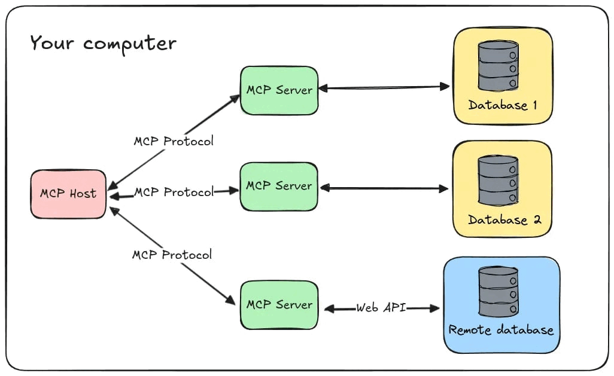

# MCP Server Using Python SDK



## 1. Thêm API key cần thiết cho chương trình

Tạo .env trong 2 folder client & server
```
    Hãy xem .env.example
```

## 2. Để chạy MCP server 

```
    - cd server
    - python your_file.py
```

## 3. Chạy máy khách kết nối với MCP Server

```
    - cd client
    - Hãy lựa chọn kiểu kết nối phù hợp với MCP server [stdio, sse]
    - python your_file.py
```